# 批次 5-0521：49 个游戏克隆编程练习初筛

来源：[Invent with Python - "I Need Practice Programming": 49 Ideas for Game Clones to Code](https://inventwithpython.com/blog/i-need-practice-programming-49-ideas-for-game-clones-to-code.html)，作者 Al Sweigart，原文发布时间 2012-02-20。

## 原文分类统计

| 原文分类 | 数量 | 编号范围/内容 | 说明 |
| --- | ---: | --- | --- |
| Orisinal Games | - | Winter Bells、A Daily Cup of Tea、Bugs、Hold the Rope 等 | 原文先推荐 Orisinal 站点作为简单 Flash 游戏灵感池，未计入 49 个编号条目。 |
| Invent Your Own Computer Games with Python / Making Games with Python & Pygame | 12 | 1-12 | 原文书籍案例，有源码或章节说明，最适合快速复现与规则验证。 |
| Board Games / Card Games | 15 | 13-27 | 规则清晰、状态离散，适合棋盘、牌面、骰子、路径与策略类 VQA。 |
| Action Games | 22 | 28-49 | 强交互、物理或实时控制较多；静态图可抽取瞬时状态、碰撞、轨迹、威胁判断。 |
| 合计 | 49 | 1-49 | 原文标题中的 49 个游戏克隆创意。 |

## 游戏条目表

| 名称 | 来源 | 规则描述 | 静态图形式 | 分类 | 可生成的 VQA 类型+Python 生成/验证思路 |
| --- | --- | ---- | ----- | ----------- | -------------- |
| Dodger | [题目](https://inventwithpython.com/blog/i-need-practice-programming-49-ideas-for-game-clones-to-code.html#dodger) [源码1](https://inventwithpython.com/dodger.zip?27f655) | 多个敌人从屏幕上方落下，玩家移动躲避；存活越久分数越高。 | 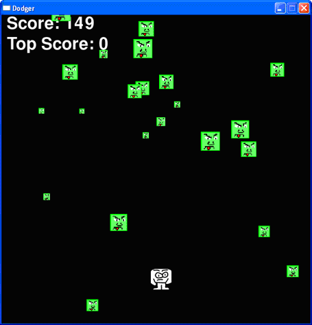 [原图](https://inventwithpython.com/images/20-1.png) | 书籍案例 / 动作躲避 | 计数敌人、最近威胁方向、安全移动方向。Python 随机生成敌人坐标和速度，用包围盒碰撞、距离和未来位置验证答案。 |
| Memory Puzzle | [题目](https://inventwithpython.com/blog/i-need-practice-programming-49-ideas-for-game-clones-to-code.html#memorypuzzle) [源码1](https://inventwithpython.com/memorypuzzle.py) | 翻开两张卡片，若图案匹配则保留，否则盖回；目标是配完全部卡片。 | 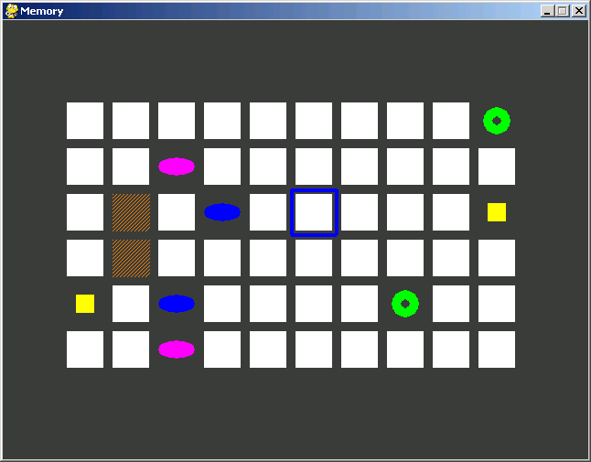 [原图](https://inventwithpython.com/images/memory_screenshot.png) | 书籍案例 / 记忆配对 | 判断翻开的图案是否成对、定位同类卡片、统计剩余未配对数。Python 生成成对符号矩阵和翻开掩码，直接从状态表验证。 |
| Sliding Puzzle | [题目](https://inventwithpython.com/blog/i-need-practice-programming-49-ideas-for-game-clones-to-code.html#slidingpuzzle) [源码1](https://inventwithpython.com/slidepuzzle.py) | 4x4 数字拼图含一个空格，通过滑动相邻方块恢复顺序。 | 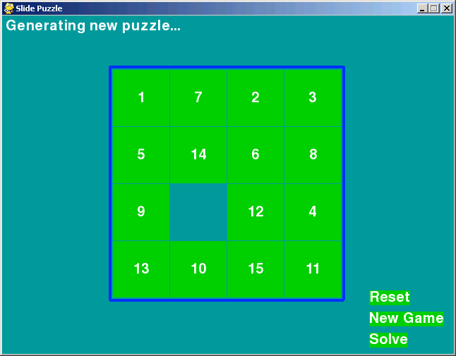 [原图](https://inventwithpython.com/images/slidepuzzle_screenshot.png) | 书籍案例 / 滑块益智 | 识别空格邻居、判断某步是否合法、比较当前与目标序。Python 从有序盘面随机执行合法滑动，记录可逆移动与曼哈顿距离。 |
| Simon | [题目](https://inventwithpython.com/blog/i-need-practice-programming-49-ideas-for-game-clones-to-code.html#simon) [源码1](https://inventwithpython.com/simulate.py) | 四个彩色按钮按序亮起，玩家需按相同顺序复现，序列逐轮变长。 | 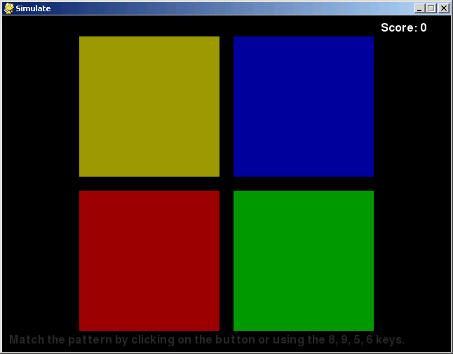 [原图](https://inventwithpython.com/images/simulate_screenshot.png) | 书籍案例 / 记忆序列 | 当前高亮颜色、序列补全、错误点击判定。Python 保存颜色序列、当前播放索引和玩家输入前缀验证。 |
| Nibbles | [题目](https://inventwithpython.com/blog/i-need-practice-programming-49-ideas-for-game-clones-to-code.html#nibbles) [源码1](https://inventwithpython.com/wormy.py) | 蛇持续移动，吃苹果变长，撞墙或撞到自身结束。 | 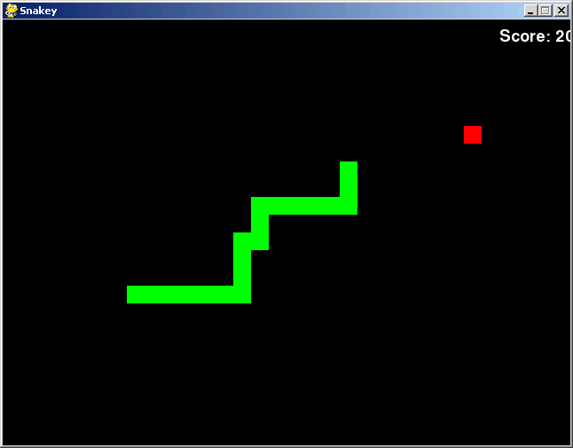 [原图](https://inventwithpython.com/images/snakey_screenshot.png) | 书籍案例 / 贪吃蛇 | 统计蛇长、苹果相对方位、下一步是否碰撞。Python 用列表保存蛇身坐标，集合查占用，模拟一步验证。 |
| Tetris | [题目](https://inventwithpython.com/blog/i-need-practice-programming-49-ideas-for-game-clones-to-code.html#tetris) [源码1](https://inventwithpython.com/tetromino.py) | 四连方块下落，玩家旋转和放置以填满并消除整行。 | 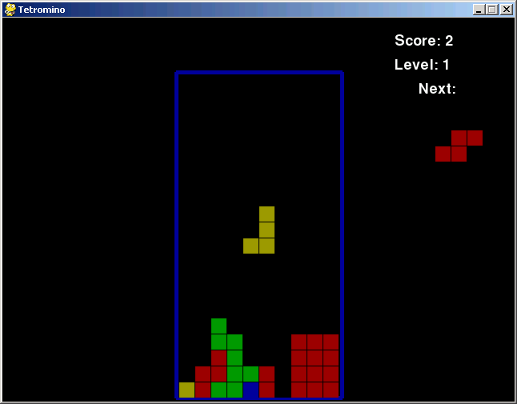 [原图](https://inventwithpython.com/images/tetromino_screenshot.png) | 书籍案例 / 下落消除 | 识别方块形状、判断满行/差一格行、选择可清行落点。Python 定义 7 种方块矩阵，做碰撞、旋转和行满检测。 |
| Katamari Damacy | [题目](https://inventwithpython.com/blog/i-need-practice-programming-49-ideas-for-game-clones-to-code.html#katamaridamacy) [源码1](https://inventwithpython.com/squirrel.zip?27f655) | 玩家控制球体或对象吸附更小物体成长，避开更大物体。 | 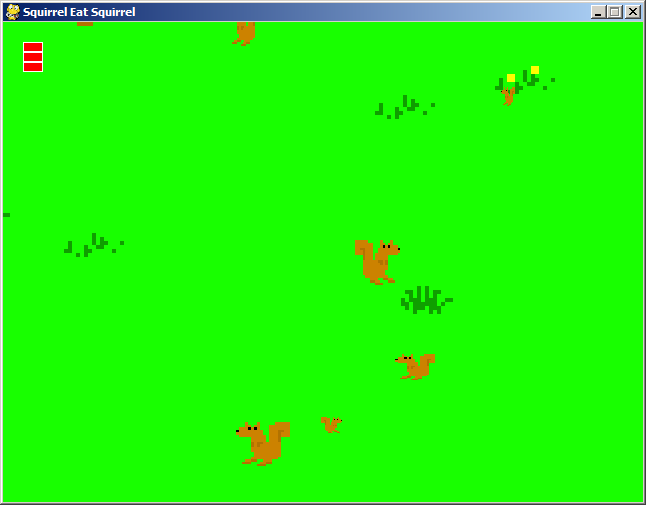 [原图](https://inventwithpython.com/images/squirrel_screenshot.png) | 书籍案例 / 成长收集 | 比较大小、统计可吸附对象、判断碰撞后成长或受损。Python 为对象存半径和坐标，用半径阈值和距离验证。 |
| Sokoban | [题目](https://inventwithpython.com/blog/i-need-practice-programming-49-ideas-for-game-clones-to-code.html#sokoban) [源码1](https://inventwithpython.com/starpusher.zip?27f655) | 玩家推动箱子到目标点；箱子只能推不能拉。 | 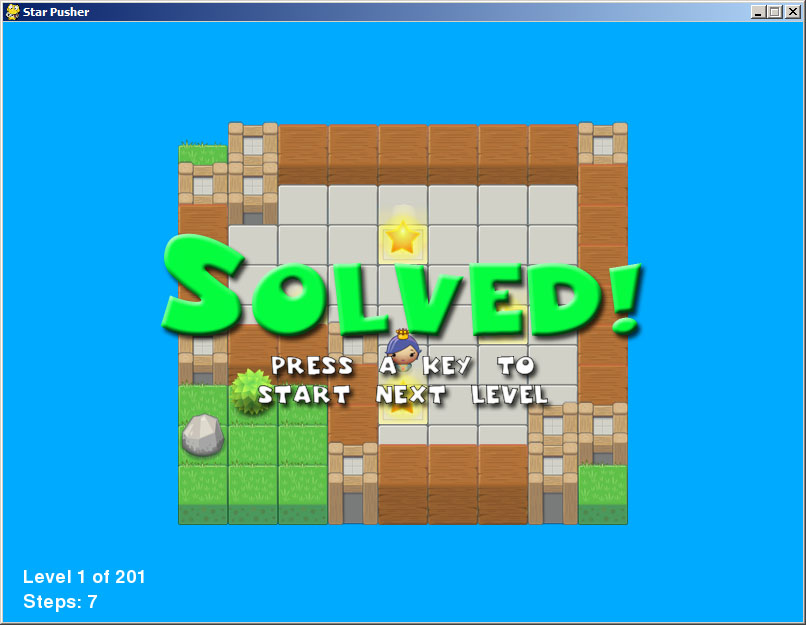 [原图](https://inventwithpython.com/images/starpusher_screenshot1.jpg) | 书籍案例 / 推箱子 | 统计已到位箱子、判断某次推动是否合法、发现墙角死锁。Python 用字符网格、BFS 可达性和推箱状态转移验证。 |
| Othello | [题目](https://inventwithpython.com/blog/i-need-practice-programming-49-ideas-for-game-clones-to-code.html#othello) [源码1](https://inventwithpython.com/flippy.zip?27f655) | 黑白双方落子夹住对方棋子，被夹住的棋子翻转；终局多者胜。 | 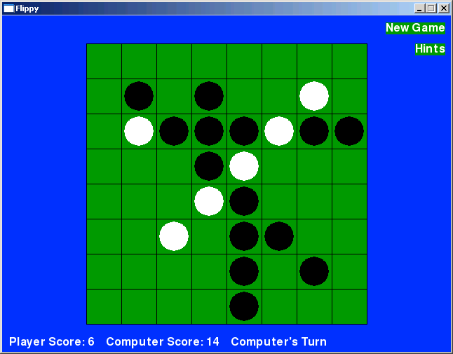 [原图](https://inventwithpython.com/images/flippy_screenshot.png) | 书籍案例 / 棋类策略 | 统计棋子差、判断合法落子、找翻转最多的位置。Python 扫描 8 个方向计算夹击链。 |
| Flood It | [题目](https://inventwithpython.com/blog/i-need-practice-programming-49-ideas-for-game-clones-to-code.html#floodit) [源码1](https://inventwithpython.com/inkspill.zip?27f655) | 从左上角区域开始变色并 flood fill，有限步内把全盘变成一种颜色。 | 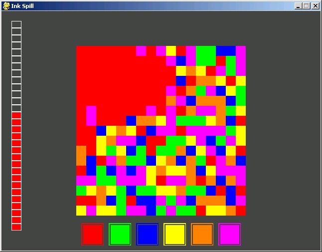 [原图](https://inventwithpython.com/images/inkspill_screenshot2.png) | 书籍案例 / 色彩填充 | 识别当前连通区域、选择扩张最多的颜色、统计剩余颜色块。Python BFS 连通域，枚举颜色后计算新增覆盖。 |
| Connect Four | [题目](https://inventwithpython.com/blog/i-need-practice-programming-49-ideas-for-game-clones-to-code.html#connectfour) [源码1](https://inventwithpython.com/fourinarow.zip?27f655) | 两色棋子从列顶落下，先横竖斜连成四子者胜。 | 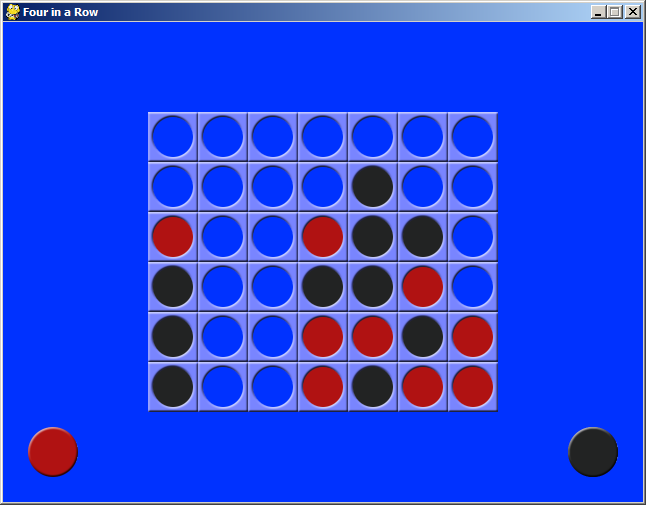 [原图](https://inventwithpython.com/images/fourinarow_screenshot.png) | 书籍案例 / 棋类策略 | 判断三连威胁、找立即获胜列、找必须阻挡列。Python 模拟落子重力并检查四方向连线。 |
| Bejeweled | [题目](https://inventwithpython.com/blog/i-need-practice-programming-49-ideas-for-game-clones-to-code.html#bejeweled) [源码1](https://inventwithpython.com/gemgem.zip?27f655) | 交换相邻宝石，使三个或更多同色/同形连成线后消除。 | 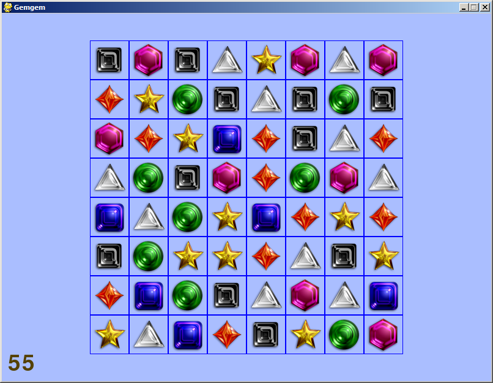 [原图](https://inventwithpython.com/images/gemgem_screenshot.png) | 书籍案例 / 三消 | 找可消除交换、统计宝石种类、预测消除后下落。Python 枚举相邻交换，检测横竖三连并模拟重力。 |
| Mancala | [题目](https://inventwithpython.com/blog/i-need-practice-programming-49-ideas-for-game-clones-to-code.html#mancala) [源码1](http://www.pygame.org/project-pyAwale-464-3779.html) | 玩家从坑中取石子并沿棋盘播种，按规则获得或捕获石子。 | 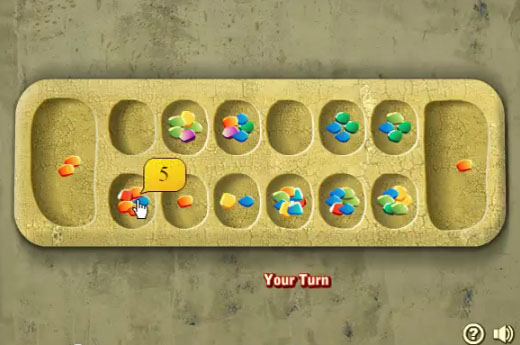 [原图](https://inventwithpython.com/blogstatic/mancala.jpg) | 桌游 / 计数策略 | 统计某坑石子、预测最后一颗落点、判断是否触发再行动。Python 用循环列表表示坑位并执行播种。 |
| Tic-tac-toe | [题目](https://inventwithpython.com/blog/i-need-practice-programming-49-ideas-for-game-clones-to-code.html#tictactoe) | 3x3 棋盘轮流放 X/O，先连成三子者胜。 | 原文无截图；3x3 格子内有 X、O 或空格。 | 桌游 / 入门棋类 | 判断胜负、找一步获胜/阻挡位置、统计空格。Python 穷举 8 条线和所有合法下一步。 |
| Quarto | [题目](https://inventwithpython.com/blog/i-need-practice-programming-49-ideas-for-game-clones-to-code.html#quarto) | 4x4 棋盘上放置带四种二元属性的棋子，任一行列斜线共享某属性即胜。 | 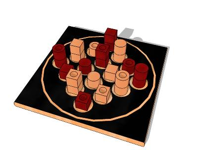 [原图](https://inventwithpython.com/blogstatic/quarto.jpg) | 桌游 / 多属性逻辑 | 识别棋子属性、判断某线是否共享属性、找可获胜放置点。Python 用 4-bit 编码棋子属性，按线做按位一致性检测。 |
| Abalone | [题目](https://inventwithpython.com/blog/i-need-practice-programming-49-ideas-for-game-clones-to-code.html#abalone) | 六边形棋盘上推动己方球，试图把对方球推出边界。 | 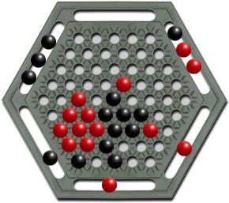 [原图](https://inventwithpython.com/blogstatic/abalone.jpg) | 桌游 / 六边形棋类 | 统计边缘球、判断一组三球能否推动、识别出界风险。Python 用 axial/cube 六边形坐标和方向向量验证移动。 |
| Quoridor | [题目](https://inventwithpython.com/blog/i-need-practice-programming-49-ideas-for-game-clones-to-code.html#quoridor) | 玩家移动棋子到对岸，也可放墙阻挡，但不能完全封死路径。 | 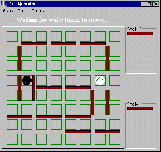 [原图](https://inventwithpython.com/blogstatic/quoridor.gif) | 桌游 / 路径策略 | 判断路径是否存在、计算到目标边最短路、验证放墙是否合法。Python 建图后用 BFS 检查双方仍有通路。 |
| Minotaurus | [题目](https://inventwithpython.com/blog/i-need-practice-programming-49-ideas-for-game-clones-to-code.html#minotaurus) | 迷宫竞速类棋盘游戏，玩家移动棋子并受迷宫怪物威胁。 | 原文无截图；迷宫网格，玩家棋子、怪物、墙或挡板。 | 桌游 / 迷宫策略 | 计算怪物到玩家距离、判断玩家可达出口、选择更安全移动。Python 用网格图最短路和威胁距离图验证。 |
| Stratego | [题目](https://inventwithpython.com/blog/i-need-practice-programming-49-ideas-for-game-clones-to-code.html#stratego) | 双方棋子有隐藏等级，移动并比较等级，目标是夺旗。 | 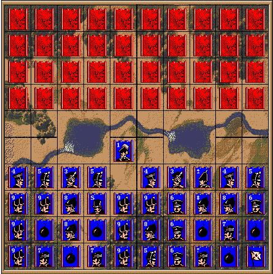 [原图](https://inventwithpython.com/blogstatic/stratego.jpg) | 桌游 / 信息推理 | 比较等级胜负、识别军旗可能位置、判断可移动棋子。Python 存棋子等级、特殊炸弹/间谍规则和可见性。 |
| Blackjack | [题目](https://inventwithpython.com/blog/i-need-practice-programming-49-ideas-for-game-clones-to-code.html#blackjack) | 手牌点数尽量接近 21 且不爆牌，A 可算 1 或 11。 | 原文无截图；玩家和庄家的扑克牌牌面。 | 卡牌 / 概率决策 | 计算手牌点数、判断是否爆牌、给出 hit/stand 基础策略。Python 映射牌点并处理 A 的最优计分。 |
| Scrabble | [题目](https://inventwithpython.com/blog/i-need-practice-programming-49-ideas-for-game-clones-to-code.html#scrabble) [源码1](http://wordlist.sourceforge.net/) | 在 15x15 棋盘上摆字母拼词，按字母和奖励格计分。 | 原文无截图；字母块、奖励格、已形成单词的棋盘。 | 桌游 / 语言策略 | 读出横向/纵向单词、计算分数、判断落子是否连接。Python 用词典、字母分和奖励格矩阵验证。 |
| Grid Lock / Traffic Jam | [题目](https://inventwithpython.com/blog/i-need-practice-programming-49-ideas-for-game-clones-to-code.html#gridlock) | 在拥堵网格中滑动车辆，让目标车从出口离开。 | 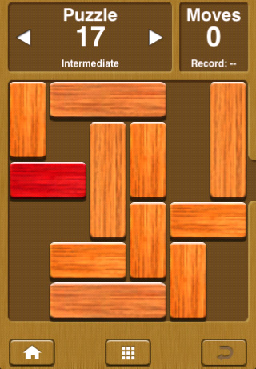 [原图](https://inventwithpython.com/blogstatic/gridlock.jpg) | 桌游 / 滑块路径 | 判断哪辆车挡路、目标车距出口几格、验证移动合法性。Python 存车辆矩形、方向和占用网格，可用 BFS/A* 解题。 |
| Yahtzee | [题目](https://inventwithpython.com/blog/i-need-practice-programming-49-ideas-for-game-clones-to-code.html#yahtzee) | 五个骰子通过重掷组合成指定牌型并计分。 | 原文无截图；五个骰子的点数图。 | 桌游 / 骰子概率 | 识别点数、判断 full house/顺子/五同、计算当前类别得分。Python 统计点数频次并匹配组合规则。 |
| Risk | [题目](https://inventwithpython.com/blog/i-need-practice-programming-49-ideas-for-game-clones-to-code.html#risk) | 玩家在地图领土上部署兵力、攻击相邻区域并扩张。 | 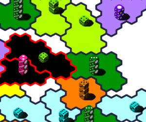 [原图](https://inventwithpython.com/blogstatic/dicewars.jpg) | 桌游 / 图策略 | 比较兵力、判断相邻可攻、识别薄弱边界。Python 用图邻接表和区域兵力字典验证。 |
| Checkers / Draughts | [题目](https://inventwithpython.com/blog/i-need-practice-programming-49-ideas-for-game-clones-to-code.html#checkers) | 棋子斜向移动并跳吃对方，升王后获得更强移动能力。 | 原文无截图；8x8 深浅棋盘，圆片棋子和王标记。 | 桌游 / 棋类策略 | 统计双方棋子、判断跳吃/连跳、识别可升王棋子。Python 用方向规则枚举合法步和捕获序列。 |
| Chess | [题目](https://inventwithpython.com/blog/i-need-practice-programming-49-ideas-for-game-clones-to-code.html#chess) | 国际象棋，按棋子类型移动，将死对方国王获胜。 | 原文无截图；8x8 棋盘和不同棋子图标。 | 桌游 / 棋类策略 | 识别棋子位置、判断将军、找合法移动或吃子。Python 可用 python-chess 生成/验证 FEN、合法步和攻击关系。 |
| Go | [题目](https://inventwithpython.com/blog/i-need-practice-programming-49-ideas-for-game-clones-to-code.html#go) | 玩家在网格交点落黑白子，围地并通过断气提子。 | 原文无截图；19x19 或小棋盘，黑白棋子位于线交点。 | 桌游 / 围地策略 | 计算气、判断某块是否可被提、估计连通块/领地。Python 用并查集或 BFS 统计棋块和 liberties。 |
| Asteroids | [题目](https://inventwithpython.com/blog/i-need-practice-programming-49-ideas-for-game-clones-to-code.html#asteroids) | 飞船旋转射击小行星，小行星被击中后分裂，玩家需避免碰撞。 | 原文无截图；黑色背景，线框飞船、不规则陨石、多发子弹。 | 动作游戏 / 射击物理 | 统计大小陨石、最近陨石方位、判断子弹是否命中。Python 生成多边形/圆形近似、速度向量和碰撞半径。 |
| Space Invaders | [题目](https://inventwithpython.com/blog/i-need-practice-programming-49-ideas-for-game-clones-to-code.html#spaceinvaders) | 外星人阵列左右移动并逐步下降，玩家在底部射击。 | 原文无截图；上方多行敌人、底部玩家炮台、中间掩体。 | 动作游戏 / 阵列射击 | 统计剩余敌人、识别最低敌人行、预测下一轮移动方向。Python 用二维阵列和步进方向状态验证。 |
| Tron | [题目](https://inventwithpython.com/blog/i-need-practice-programming-49-ideas-for-game-clones-to-code.html#tron) | 玩家持续移动并留下墙状轨迹，撞到墙或轨迹即失败。 | 原文无截图；网格上多条彩色轨迹和当前位置。 | 动作游戏 / 区域竞争 | 判断下一步是否撞墙、估计可达空间、选择更长生存方向。Python 将轨迹写入占用网格，用 flood fill 计算空间。 |
| Missile Command | [题目](https://inventwithpython.com/blog/i-need-practice-programming-49-ideas-for-game-clones-to-code.html#missilecommand) [源码1](http://www.pygame.org/project-Patriot+Command-1394-2708.html) | 从地面发射拦截弹，在空中爆炸拦截落向城市的导弹。 | 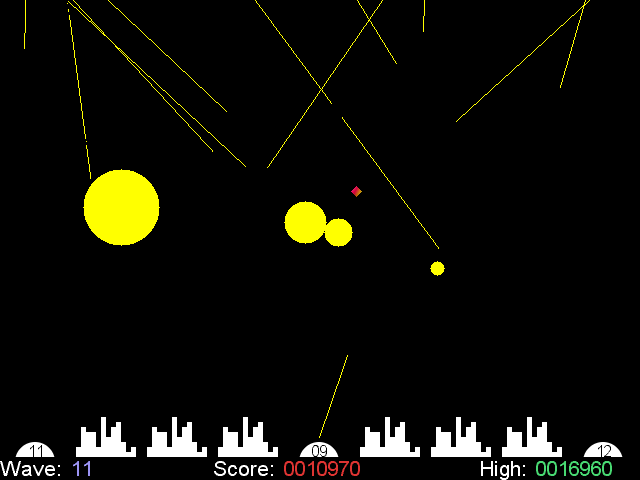 [原图](https://inventwithpython.com/blogstatic/missilecommand.gif) | 动作游戏 / 防御轨迹 | 统计威胁城市的导弹、判断爆炸是否覆盖导弹、预测落点。Python 用线段参数方程和圆碰撞验证。 |
| Pong | [题目](https://inventwithpython.com/blog/i-need-practice-programming-49-ideas-for-game-clones-to-code.html#pong) | 两侧挡板反弹小球，球越过对方得分。 | 原文无截图；左右挡板、中间小球和运动轨迹。 | 动作游戏 / 反弹对抗 | 判断球运动方向、预测挡板应上/下移动、判断是否会接到球。Python 用位置速度和边界反射模拟。 |
| Arkanoid | [题目](https://inventwithpython.com/blog/i-need-practice-programming-49-ideas-for-game-clones-to-code.html#arkanoid) [源码1](http://www.pygame.org/project-Arkanoid-1422-.html)；[源码2](http://www.pygame.org/project-Pyarkanoid+(BSG+Arkanoid)-1474-2631.html) | 挡板反弹小球击碎砖块，清空砖块过关。 | 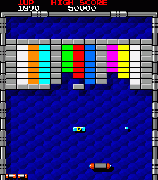 [原图](https://inventwithpython.com/blogstatic/arkanoid.png) | 动作游戏 / 消砖块 | 统计剩余砖块、识别最多颜色、预测下一块被击中砖。Python 用砖块矩阵、圆矩形碰撞和反弹向量验证。 |
| Maze | [题目](https://inventwithpython.com/blog/i-need-practice-programming-49-ideas-for-game-clones-to-code.html#maze) [源码1](http://www.pygame.org/project-Bipo+Maze-2159-.html) | 玩家在迷宫中寻找出口，重点可放在迷宫生成和寻路。 | 原文无截图；迷宫墙体网格，起点、终点和当前位置。 | 动作游戏 / 路径益智 | 判断是否连通、选择岔路方向、计算最短路径长度。Python 用 DFS/Prim/Kruskal 生成迷宫，BFS 验证答案。 |
| Scorched Earth / Worms / Gorillas / Angry Birds | [题目](https://inventwithpython.com/blog/i-need-practice-programming-49-ideas-for-game-clones-to-code.html#scorchedearth) | 玩家在地形上调角度和力度发射炮弹，击中对手。 | 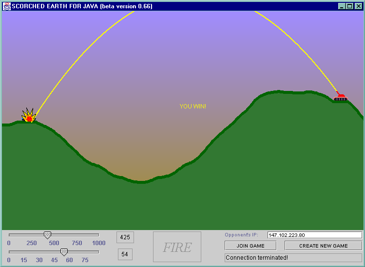 [原图](https://inventwithpython.com/blogstatic/scorchedearth.gif) | 动作游戏 / 抛物线物理 | 读炮管角度、判断弹道落点、预测是否越过山峰。Python 用重力抛物线采样和地形高度函数验证。 |
| Lunar Lander | [题目](https://inventwithpython.com/blog/i-need-practice-programming-49-ideas-for-game-clones-to-code.html#lunarlander) | 飞船在重力和有限燃料下控制姿态与速度，平稳降落平台。 | 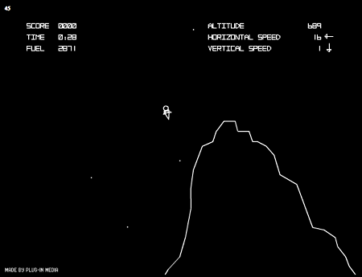 [原图](https://inventwithpython.com/blogstatic/lunarlander.png) | 动作游戏 / 物理控制 | 判断是否对准平台、速度是否安全、姿态是否倾斜。Python 模拟重力、推力、速度阈值和平台碰撞。 |
| Snood / Bust-a-Move | [题目](https://inventwithpython.com/blog/i-need-practice-programming-49-ideas-for-game-clones-to-code.html#snood) | 从底部发射彩球，形成三个同色相连后消除，上方球阵逐步压低。 | 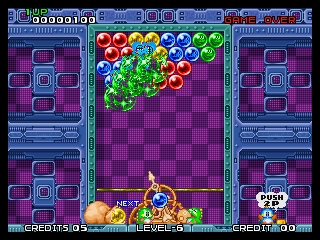 [原图](https://inventwithpython.com/blogstatic/bustamove.jpg) | 动作游戏 / 泡泡消除 | 找最佳射击点、判断同色连通块大小、识别即将触底列。Python 用六边形网格邻接和连通分量验证。 |
| Fruit Ninja | [题目](https://inventwithpython.com/blog/i-need-practice-programming-49-ideas-for-game-clones-to-code.html#fruitninja) | 物体被抛到屏幕上，玩家划过目标物体；部分物体可能是惩罚物。 | 原文无截图；空中水果、炸弹、切割轨迹和半水果。 | 动作游戏 / 反应切割 | 统计水果/炸弹、判断切线经过哪些目标、预测物体最高点。Python 生成抛物线轨迹，用线段与圆相交验证。 |
| Last Stand | [题目](https://inventwithpython.com/blog/i-need-practice-programming-49-ideas-for-game-clones-to-code.html#laststand) | 每轮敌人冲击 barricade，玩家射击防守并在回合间修复或升级。 | 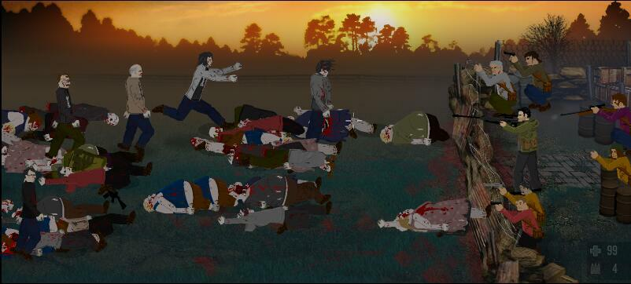 [原图](https://inventwithpython.com/blogstatic/laststand.jpg) | 动作游戏 / 防守射击 | 找最近敌人、统计突破威胁、判断优先射击目标。Python 存敌人位置、速度、血量，按到达时间排序验证。 |
| Duck Hunt | [题目](https://inventwithpython.com/blog/i-need-practice-programming-49-ideas-for-game-clones-to-code.html#duckhunt) | 鸭子在屏幕中飞行，玩家用有限弹药点击射击。 | 原文无截图；背景草丛、飞行目标、准星和弹药数。 | 动作游戏 / 目标射击 | 统计可见鸭子、判断准星相对方位、检测点击是否命中。Python 用目标包围盒/椭圆和准星坐标验证。 |
| Rampart | [题目](https://inventwithpython.com/blog/i-need-practice-programming-49-ideas-for-game-clones-to-code.html#rampart) | 玩家交替修城墙与射击敌船，城堡被完整围住才能继续防守。 | 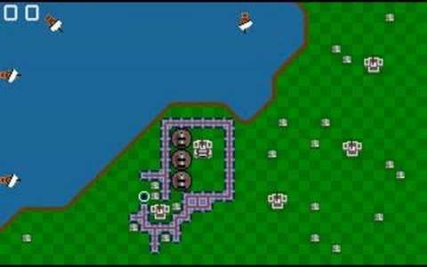 [原图](https://inventwithpython.com/blogstatic/rampart.jpg) | 动作游戏 / 防御建造 | 判断城堡是否闭合包围、找墙缺口、选择补墙位置。Python 用栅格墙体和 flood fill 检查封闭区域。 |
| Bloxorz | [题目](https://inventwithpython.com/blog/i-need-practice-programming-49-ideas-for-game-clones-to-code.html#bloxorz) | 2x1 长方体在瓷砖平台上翻滚，目标是竖直落入洞口。 | 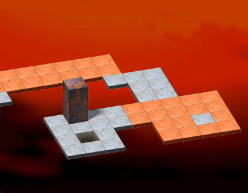 [原图](https://inventwithpython.com/blogstatic/bloxorz.jpg) | 动作游戏 / 空间翻滚 | 判断长方体姿态、预测翻滚后占用格、判断是否掉落。Python 用两个格坐标或竖立状态表示方块并执行方向转移。 |
| Dr. Mario | [题目](https://inventwithpython.com/blog/i-need-practice-programming-49-ideas-for-game-clones-to-code.html#drmario) | 双色药丸下落，与同色病毒/药丸连成四个即消除，清空病毒获胜。 | 原文无截图；瓶状容器、彩色病毒、正在下落的双色药丸。 | 动作游戏 / 下落消除 | 统计某色病毒、判断药丸旋转放置、预测四连消除。Python 用网格、药丸二格状态和横竖四连检测。 |
| Kirby's Avalanche / Puyo Puyo | [题目](https://inventwithpython.com/blog/i-need-practice-programming-49-ideas-for-game-clones-to-code.html#puyopuyo) | 两个一组的彩色软泥下落，四个或更多同色连通后消除并可能连锁。 | 原文无截图；垂直网格中彩色圆块/软泥，顶部有下落对子。 | 动作游戏 / 连锁消除 | 识别最大连通块、预测是否连锁、统计掉落后新组合。Python 用连通分量、重力压缩和循环消除验证。 |
| Fire 'N' Ice | [题目](https://inventwithpython.com/blog/i-need-practice-programming-49-ideas-for-game-clones-to-code.html#firenice) | 玩家制造/移除冰块并推动冰块熄灭火焰，兼有平台和解谜。 | 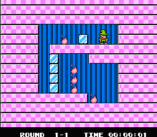 [原图](https://inventwithpython.com/blogstatic/firenice.gif) | 动作游戏 / 平台解谜 | 判断哪块冰可推、路径是否可达、预测冰块落下是否灭火。Python 用 tile map、简单重力和推块规则验证。 |
| Typespeed | [题目](https://inventwithpython.com/blog/i-need-practice-programming-49-ideas-for-game-clones-to-code.html#typespeed) | 单词缓慢向屏幕一侧移动，玩家输入对应单词消除。 | 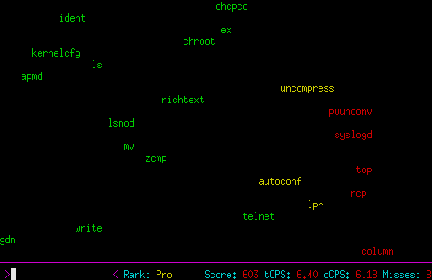 [原图](https://inventwithpython.com/blogstatic/typespeed.png) | 动作游戏 / 打字文字 | 识别最长/最近边界单词、统计单词数、判断输入匹配目标。Python 生成词表、坐标和速度，按 x 坐标排序验证。 |
| Diner Dash | [题目](https://inventwithpython.com/blog/i-need-practice-programming-49-ideas-for-game-clones-to-code.html#dinerdash) | 同时管理排队、点餐、送餐、收桌等多步骤任务。 | 原文无截图；餐厅俯视图，桌椅、顾客、服务员和餐盘状态。 | 动作游戏 / 时间管理 | 判断哪桌等待最长、服务员携带物、下一步最优任务。Python 用顾客状态机、等待计时和任务队列验证。 |
| Pipe Dream | [题目](https://inventwithpython.com/blog/i-need-practice-programming-49-ideas-for-game-clones-to-code.html#pipedream) | 在网格上放置不可旋转的管道片，水流开始后沿连通管道前进。 | 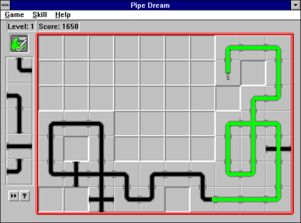 [原图](https://inventwithpython.com/blogstatic/pipedream.png) | 动作游戏 / 管道连通 | 判断水最终出口、找断开的管道、验证某片能否连通。Python 为管道片定义端口集合，沿方向遍历拓扑。 |
| Zoop | [题目](https://inventwithpython.com/blog/i-need-practice-programming-49-ideas-for-game-clones-to-code.html#zoop) | 彩色形状从四边向中心推进，玩家变成对应颜色后消除同色形状。 | 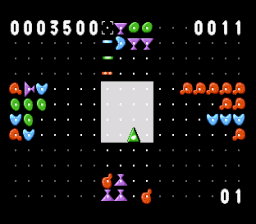 [原图](https://inventwithpython.com/blogstatic/zoop.gif) | 动作游戏 / 四向消除 | 找最近威胁边、判断当前颜色可消除队列、统计各边压力。Python 用四个方向数组表示推进队列和中心距离。 |

## 初步筛选建议

| 优先级 | 条目 | 原因 |
| --- | --- | --- |
| 高 | Sliding Puzzle、Sokoban、Othello、Flood It、Connect Four、Bejeweled、Bloxorz、Pipe Dream | 状态离散、规则可验证、静态图能表达完整问题，适合自动生成 VQA ground truth。 |
| 中 | Dodger、Nibbles、Tetris、Arkanoid、Maze、Pong、Snood、Dr. Mario、Puyo Puyo | 需要处理运动或重力，但可抽成单帧状态判断。 |
| 谨慎 | Chess、Go、Scrabble、Risk、Diner Dash、Fire 'N' Ice | 规则或语义空间较大，适合先做简化版或小棋盘子任务。 |

